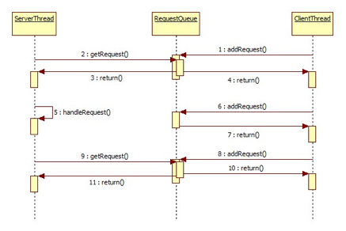

Guarded-Suspension模式
=====

Guarded-Suspension意为保护暂停，其核心思想是仅当服务进程准备好，才提供服务。设　想一种场景，服务器可能会在很短时间内承受大量的客户端请求，客户端请求的数量可能超过服务器本身的即时处理能力，而服务器程序又不能丢弃任何一个客户请求。此时，最佳的处理方案莫过于让客户端请求进行排队，由服务端程序一个接一个处理。这样既保征了所有的客户端请求均不丢失，同时也避免了服务器由于同时处理太多的请求而崩溃。

(1)	Guarded-Suspension结构

Guarded-Suspension模式的主要角色

角色				| 作用
---				| ---
Request			| 表示客户端请求
RequestQueue	| 用于保存客户端请求队列
ClientThread	| 客户端进程
ServerThread	| 服务端进程

ClientThread负责不断的发起请求，并将请求对象放入请求队列。ServerThread则根据其自身的状态，在有能力处理请求时，从RequestQueue中提取请求对象加以处理，系统的工作流程如图：



#代码实现
###(1)	Request.java
```java
public class Request {
    private String name;
	public Request(String name) {
        this.name = name;
    }
    public String getName() {
        return name;
    }
    public String toString() {
        return "[ Request " + name + " ]";
    }
}
```

###(2)	RequestQueue.java

```java
import java.util.LinkedList;

public class RequestQueue {
	private LinkedList<Request> queue = new LinkedList<Request>();

	public synchronized Request getRequest() {
		while (queue.size() == 0) {
			try {
				wait();
			} catch (InterruptedException e) {
			}
		}
		return (Request) queue.remove();
	}

	public synchronized void addRequest(Request request) {
		queue.add(request);
		notifyAll(); // 通知getRequest()方法
	}
}
```

###(3)	ClientThread.java

```java
public class ClientThread extends Thread {
    private RequestQueue requestQueue;
    public ClientThread(RequestQueue requestQueue, String name) {
        super(name);
        this.requestQueue = requestQueue;
    }
    public void run() {
        for (int i = 0; i < 10; i++) {
            Request request = new Request("RequestID:" + i+" Thread_Name:"+Thread.currentThread().getName());
            System.out.println(Thread.currentThread().getName() + " requests " + request);
            requestQueue.addRequest(request);
            try {
                Thread.sleep(10);
            } catch (InterruptedException e) {
            }
            System.out.println("ClientThread Name is:"+Thread.currentThread().getName());
        }
        System.out.println(Thread.currentThread().getName()+" request end");
    }
}
```
###(4)	ServerThread.java
```java
public class ServerThread extends Thread {
    private RequestQueue requestQueue;
    public ServerThread(RequestQueue requestQueue, String name) {
        super(name);
        this.requestQueue = requestQueue;
    }
    public void run() {
        while (true) {
            final Request request = requestQueue.getRequest();
            try {
				Thread.sleep(100);
			} catch (InterruptedException e) {
				e.printStackTrace();
			}
            System.out.println(Thread.currentThread().getName() + " handles  " + request);
            
        }
    }
}
```

###(5)	Main.java
```java
public class Main {
	public static void main(String[] args) {
		RequestQueue requestQueue = new RequestQueue();
		for (int i = 0; i < 10; i++) {
			new ServerThread(requestQueue, "ServerThread" + i).start();
		}
		for (int i = 0; i < 10; i++) {
			new ClientThread(requestQueue, "ClientThread" + i).start();
		}
	}
}
```

```
执行结果：
ClientThread4 requests [ Request RequestID:0 Thread_Name:ClientThread4 ]
…省略…
ClientThread Name is:ClientThread1
ClientThread Name is:ClientThread4
ClientThread Name is:ClientThread2
ClientThread4 requests [ Request RequestID:1 Thread_Name:ClientThread4 ]
ClientThread1 requests [ Request RequestID:1 Thread_Name:ClientThread1 ]
ClientThread2 requests [ Request RequestID:1 Thread_Name:ClientThread2 ]
…省略…
ServerThread1 handles  [ Request RequestID:0 Thread_Name:ClientThread8 ]
ClientThread Name is:ClientThread3
ClientThread3 request end
ServerThread3 handles  [ Request RequestID:0 Thread_Name:ClientThread3 ]
ServerThread7 handles  [ Request RequestID:0 Thread_Name:ClientThread2 ]
ClientThread Name is:ClientThread5
ClientThread Name is:ClientThread1
ClientThread1 request end
ClientThread Name is:ClientThread6
ServerThread0 handles  [ Request RequestID:0 Thread_Name:ClientThread5 ]
ClientThread6 request end
ClientThread5 request end
ServerThread8 handles  [ Request RequestID:1 Thread_Name:ClientThread1 ]
ServerThread9 handles  [ Request RequestID:1 Thread_Name:ClientThread4 ]
…省略…
ServerThread6 handles  [ Request RequestID:9 Thread_Name:ClientThread3 ]
```